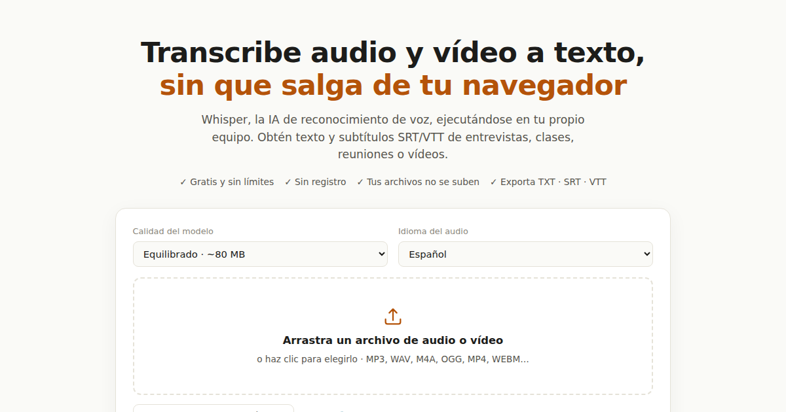

# Gate32 · Transcripción y subtítulos con IA, 100 % en tu navegador

**https://gate32.autoritasai.com**

Convierte audio y vídeo en texto o subtítulos SRT/VTT con Whisper ejecutándose
**localmente en tu navegador**. Gratis, sin límites, sin registro y sin que tus
archivos salgan de tu equipo.



## Qué problema resuelve

Los transcriptores "gratis" habituales imponen minutos de prueba, topes por
archivo, muros de registro y — lo estructural — **suben tu audio a sus
servidores**. Las alternativas privadas son apps de escritorio (a menudo solo
macOS) o herramientas de terminal. Gate32 elimina el dilema: privacidad
verificable con la comodidad de una web.

La investigación de mercado, la matriz de 20 oportunidades y los motivos de
esta elección están en [`RESEARCH.md`](RESEARCH.md); la tesis de producto en
[`PRODUCT.md`](PRODUCT.md); las métricas y umbrales en
[`VALIDATION.md`](VALIDATION.md).

## Cómo utilizarlo

1. Entra en la web y arrastra un archivo de audio/vídeo (o graba con el micro).
2. La primera vez, el navegador descarga el modelo (≈50–250 MB según calidad)
   y lo deja cacheado; después funciona incluso sin conexión.
3. Whisper transcribe por bloques con progreso visible.
4. Corrige el texto con el audio sincronizado y exporta TXT, Markdown, SRT,
   VTT o JSON.

## Arquitectura

```
index.html            landing + shell de la app (SEO, OG, JSON-LD, FAQ)
src/main.ts           estados de la UI, edición, exports, historial
src/styles.css        diseño claro/oscuro, responsive, accesible
src/lib/
  worker.ts           Whisper vía transformers.js (WebGPU → WASM fallback)
  transcriber.ts      cliente tipado del worker (capa de IA sustituible)
  audio.ts            decodificación a mono 16 kHz (OfflineAudioContext)
  formats.ts          lógica pura: ventanas, fusión, TXT/MD/SRT/VTT/JSON
  analytics.ts        eventos anónimos de validación (Vercel Web Analytics)
  history.ts          historial local (localStorage, sin cuenta)
  types.ts            tipos y protocolo del worker
scripts/e2e.mjs       E2E de recorrido crítico (Playwright)
src/lib/__tests__/    tests unitarios (vitest)
```

Decisiones clave:

- **Sin backend de procesado.** El audio se decodifica y transcribe en el
  cliente; el único tráfico es la descarga del modelo desde el CDN de
  Hugging Face (cacheada por el navegador).
- **Ventanas solapadas** de 30 s con 5 s de solape y fusión por punto medio:
  progreso real, memoria acotada y lógica testeable.
- **Capa de IA aislada** tras `transcriber.ts`: cambiar de modelo o añadir un
  motor de servidor (plan Pro) no toca la UI.
- **Coste marginal ≈ 0 €** por usuario: el proyecto escala en un plan gratuito.

## Instalación local

```bash
npm install
npm run dev        # desarrollo
npm test           # tests unitarios
npm run build      # comprobación de tipos + build de producción
npm run preview    # servir dist/
npm run test:e2e   # E2E (CHROMIUM_PATH=/ruta/a/chromium si hace falta)
```

## Variables de entorno

**Ninguna.** No hay claves ni secretos: no existen credenciales que proteger
ni configurar. La analítica usa Vercel Web Analytics, que se activa (gratis)
desde el panel de Vercel del proyecto; hasta entonces el script es un no-op.

## Despliegue

Vercel detecta Vite automáticamente: `npm install && npm run build` → `dist/`.
Cada push a `main` publica en https://gate32.autoritasai.com.

## Limitaciones actuales

- La velocidad depende del equipo del usuario: con WebGPU (Chrome/Edge
  recientes) es varias veces más rápida que el tiempo real; sin WebGPU cae a
  WASM, útil pero lento con el modelo Preciso.
- Sin identificación de hablantes (diarización) ni resúmenes: son la capa Pro
  propuesta, pendiente de señal de demanda (`pro_interest`).
- Archivos muy largos (>~90 min) exigen memoria holgada; se avisa al usuario.
- La transcripción en Safari/iOS funciona con WASM pero sin aceleración.

## Roadmap basado en validación

Cada paso depende de los umbrales definidos en [`VALIDATION.md`](VALIDATION.md):

1. **Señal de activación ≥ 10 %** → páginas SEO por caso de uso (entrevistas,
   subtítulos, clases) y mejoras de rendimiento percibido.
2. **`pro_interest` ≥ 5 % de activados** → capa 2: resúmenes/actas (BYOK
   gratuito primero), lotes y diarización; lista de espera de pago.
3. **Finalización < 25 %** → modo híbrido opcional (procesado en servidor con
   consentimiento explícito) financiado por la capa Pro.
4. **Sin tráfico** → iterar distribución (Plan-100), no producto.

## Licencia

MIT — ver [`LICENSE`](LICENSE). El código es auditable a propósito: la promesa
de privacidad ("tu audio no sale del dispositivo") solo vale si cualquiera
puede comprobarla leyendo el código.

## Historia del proyecto

La v1 de Gate32 fue un experimento estético (terminal de embarque generativa),
archivado tras auditoría en el commit `8abfc19`
([`docs/AUDIT-v1.md`](docs/AUDIT-v1.md)). La v2 nace de la investigación de
mercado documentada en este repositorio.
