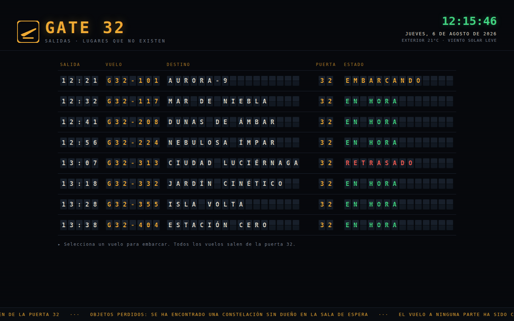
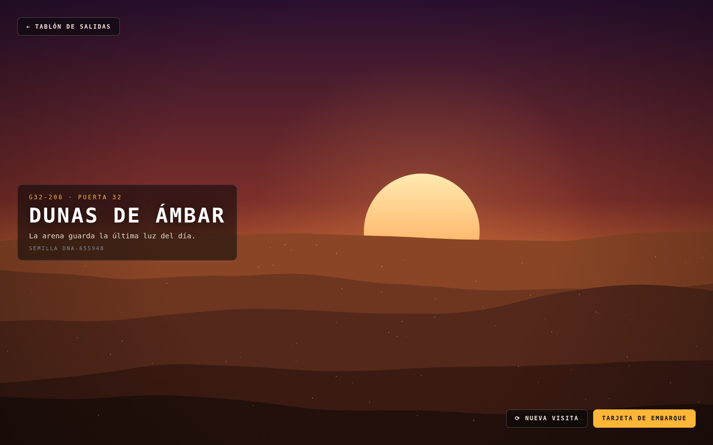
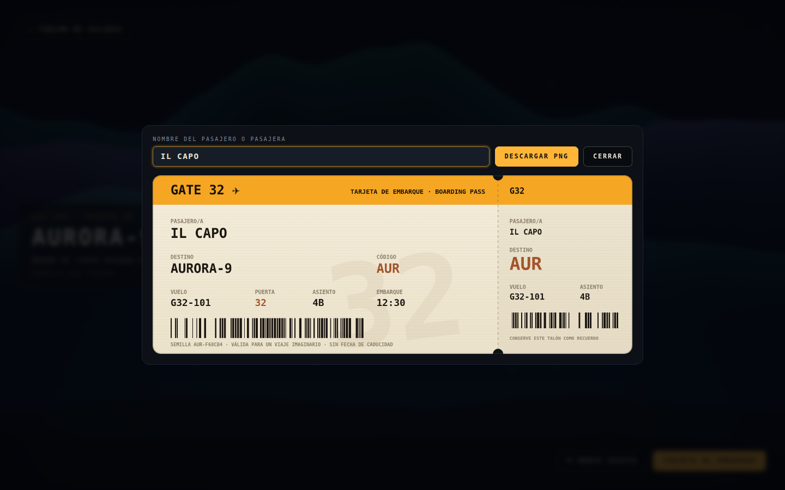

# GATE 32 ✈

**Salidas a lugares que no existen.**

Gate32 es una terminal de embarque imposible: un panel de salidas estilo
*split-flap* (las solapas giratorias de los aeropuertos de antes) donde todos
los vuelos salen de la puerta 32… y ninguno va a un lugar real.

🔗 **https://gate32.autoritasai.com**



## Cómo se viaja

1. **El panel de salidas** muestra ocho vuelos con hora, estado y megafonía
   propia. Las solapas giran de verdad, los estados cambian con el tiempo
   (EMBARCANDO, ÚLTIMA LLAMADA, RETRASADO…) y los vuelos que despegan se
   reprograman: la puerta 32 nunca cierra.
2. **Elige un vuelo** y embarcas (con su *bing-bong* de megafonía) hacia un
   paisaje generativo dibujado en canvas y animado en tiempo real. Cada visita
   nace de una **semilla aleatoria**: ningún viaje se repite.
3. **Descarga tu tarjeta de embarque** personalizada en PNG, con tu nombre,
   asiento, semilla del viaje y código de barras. Válida para un viaje
   imaginario, sin fecha de caducidad.




## Los ocho destinos

| Vuelo | Destino | El paisaje |
|---|---|---|
| G32-101 | **AURORA-9** | Cortinas de aurora boreal sobre montañas |
| G32-117 | **MAR DE NIEBLA** | Olas y bancos de niebla bajo la luna |
| G32-208 | **DUNAS DE ÁMBAR** | Atardecer retro entre capas de arena |
| G32-224 | **NEBULOSA ÍMPAR** | Polvo de estrellas en órbita lenta |
| G32-313 | **CIUDAD LUCIÉRNAGA** | Skyline nocturno con luciérnagas |
| G32-332 | **JARDÍN CINÉTICO** | Tallos que se mecen y pétalos a la deriva |
| G32-355 | **ISLA VOLTA** | Tormenta, lluvia, relámpagos y un faro |
| G32-404 | **ESTACIÓN CERO** | Casi nada: nieve, horizonte y una baliza |

## Cómo está hecho

- **Cero dependencias, cero build.** HTML + CSS + JavaScript (módulos ES)
  servidos tal cual: Vercel lo despliega sin pipeline y no hay nada que pueda
  romperse.
- **Arte 100 % procedural.** Cada mundo es un algoritmo (`js/scenes.js`) con
  PRNG con semilla (mulberry32) y ruido de valor fractal; no hay ni una sola
  imagen en el proyecto.
- **Split-flap real.** Cada celda del panel gira por caracteres intermedios
  hasta componer el texto (`js/board.js`), con arranque escalonado fila a fila.
- **Sonido sintetizado.** La megafonía se genera con WebAudio: sin ficheros.
- **Tarjeta en canvas.** La tarjeta de embarque se dibuja y exporta a PNG en
  el navegador (`js/pass.js`).
- Responsive, accesible por teclado (Esc para volver) y respeta
  `prefers-reduced-motion`.

```
index.html      la terminal
styles.css      fósforo ámbar, scanlines y solapas
js/main.js      cableado: pantallas, escena a pantalla completa, modal
js/board.js     panel split-flap, vuelos, reloj y megafonía
js/scenes.js    los ocho mundos generativos
js/pass.js      tarjeta de embarque descargable
js/util.js      PRNG con semilla, ruido y campanillas WebAudio
```

## Desarrollo local

No hace falta instalar nada:

```bash
python3 -m http.server 8032
# → http://localhost:8032
```

---

*Construido por Claude para Gate32. No deje su imaginación desatendida:
podría embarcar sin usted.*
